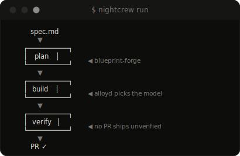

**Open to agent-infrastructure and developer-tools work** ·
[email](mailto:seanlindsay2008@gmail.com) · [seanlindsay.xyz](https://seanlindsay.xyz) · [resume](https://seanlindsay.xyz)

<table align="center">
<tr>
<td valign="top"></td>
<td valign="top"></td>
</tr>
</table>

### `$ cat spotlight/alloyd`

**[alloyd](https://github.com/SeanL128/alloyd)** — a local router that load-balances one AI workload across your own Claude and ChatGPT subscriptions.

Most people with multiple AI subscriptions burn out one provider's limits while the other sits idle. alloyd sits between your tools and the providers: it tracks each subscription's live usage windows, routes every dispatch to whichever vendor/model/effort tier has headroom, and degrades gracefully as limits approach. Built to run real workloads — my autonomous build pipelines dispatch through it daily.

*What it demonstrates:* systems design around rate-limit constraints, multi-provider orchestration, and dogfooding — the router schedules the agents that built it.

### `$ ls ~/projects`

| repo | what it does |
|---|---|
| [**alloyd**](https://github.com/SeanL128/alloyd) | Local router that load-balances one workload across your own Claude and ChatGPT subscriptions |
| [**blueprint-forge**](https://github.com/SeanL128/blueprint-forge) | Claude Code plugin: plan work as reviewable blueprints with your best model, then route the build to cheaper ones |
| [**nightcrew**](https://github.com/SeanL128/nightcrew) | A spec-to-PR build agent where no PR ships unverified |
| [**deslop**](https://github.com/SeanL128/deslop) | Claude Code plugin that removes Claude-isms — the stock phrases and reflexes that make prose read as AI-generated |
| [**shush**](https://github.com/SeanL128/shush) | Claude Code plugin that turns down output verbosity without losing substance |

This profile is animated SVG generated by three dependency-free Python scripts — the heatmap redraws itself daily via GitHub Actions. No trackers, no third-party stat services. <a href="https://github.com/SeanL128/SeanL128">Source</a>.

