[**alloyd**](https://github.com/SeanL128/alloyd) · [**nightcrew**](https://github.com/SeanL128/nightcrew) · [**deslop**](https://github.com/SeanL128/deslop) · [**shush**](https://github.com/SeanL128/shush) · [seanlindsay.xyz](https://seanlindsay.xyz) · [email](mailto:seanlindsay2008@gmail.com)

One animated SVG terminal, drawn by two dependency-free Python scripts in this repo — the contribution graph redraws itself daily via GitHub Actions. No trackers, no third-party widgets.

